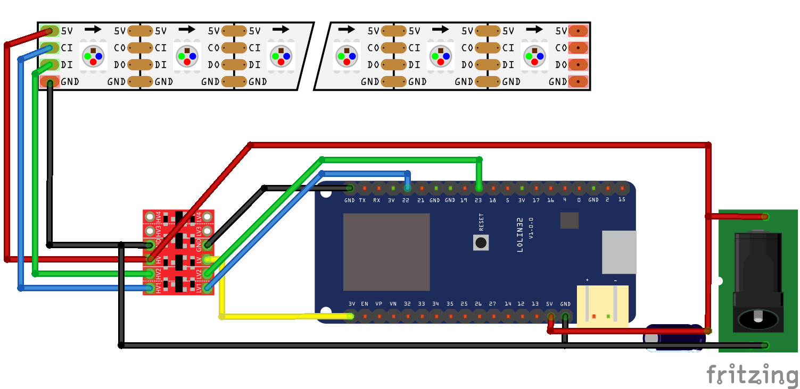

# CTA Blue Line Map

This is a project to display live train status of the CTA Blue Line on a strip map, using an ESP32 and APA102 addressable RGB LEDs.

## Pre-requisites

* Visual Studio Code
  * Platform IO extension installed
* ESP32 development board
* 33x APA102 addressable LEDs connected to the ESP32 via a logic level converter
* 5V power adapter
* [CTA Train Tracker API key](https://www.transitchicago.com/developers/traintrackerapply/)

## Instructions

1. Clone this repository and change to its directory:

```
git clone https://github.com/dremin/cta-blue-line-map.git
cd cta-blue-line-map
```

2. Create the secrets file:

```
cd include
cp secrets.h.example secrets.h
```

3. Open `secrets.h` and set your Wi-Fi SSID, password, and CTA Train Tracker API key.

4. Open the directory in Visual Studio Code with the Platform IO plugin

5. Connect the ESP32 via USB, then upload!

## LED colors

The first LED represents O'Hare. Each station's LED will display a different color, depending on the train(s) at the station:

- **No train**: Off
- **O'Hare-bound train**: Blue
- **Forest Park-bound train**: Red
- **Trains in both directions**: Purple
- **Jefferson Park-bound train**: Blue-Green
- **UIC-Halsted-bound train**: Red-Green
- **5000-series train**: Green
- **Holiday train**: White

Non-directional indicators (5000-series or holiday train) take precedence when other trains are at the same station.

## Wiring diagram

